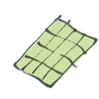
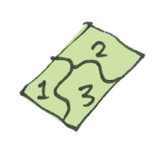
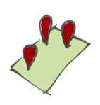
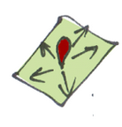
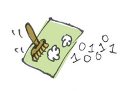

# Soiltech objects and methods (with doc blocs)

## Summary

### Objects
- GridInputFile
- NDVIInputFile
- PointAttribute
- PointDataset
- Paddock
- BuildResult
- PaddockBuildResults

### Generator Configs
Main Configs:
- SampleLocationConfig
- SoilMapConfig
- YLFConfig
- ImageConfig

Sub Configs:
- KMeansConfig
- KMeansMetricConfig
- LHCConfig


- KrigingConfig
- RegressionConfig
- AWCConfig

- BoundaryLineConfig
- YieldGapCfgConfig

### Generators
- SampleLocationGenerator
- SoilMapGenerator
- YLFGenerator
- ImageGenerator

### Processors
- DataProcessor
- SampleAlignProcessor
- KMeansProcessor
- CLHCProcessor
- PTFProcessor
- SplineProcessor
- KrigingProcessor
- RegressionProcessor
- MixProcessor
- BLAProcessor

## Objects

#### GridInputFile

``` scala
/**
  * GridInputFile - For holding information related to the input file 
  * @param uid:String - A unique identifier 
  * @param metricType:String - The property that has been measured
  * @param file:URL - the location of the file
  * @param fileType:MetricFormat.Value - can be Tiff, NetCDF or GDAL_VRT. eg use MetricFormat.Tiff
  * @param depth:Option[(Double,Double)] = None - Use if the input has a depth range (eg clay 10 to 30 cm)
  * @param isModel:Boolean = false - Use if the input is modeled and not measured directly. @shaz perhaps this should be changed to isIndirect, or something
  * @param category:Option[String] = None - @shaz, not sure
  */

case class GridInputFile(uid:String, metricType:String, file:URL, fileType:MetricFormat.Value, depth:Option[(Double,Double)] = None, isModel:Boolean = false, category:Option[String] = None)
```

@shaz, should we include the dates in these?


#### NDVIInputFile

```scala
/**
  * NDVIInputFile - Special input that holds information for calculating the NDVI from the red and nir bands
  * @param id:String - identifier for the NDVIInputFile
  * @param red:GridInputFile - contains the red band data
  * @param nir:GridInputFile - contains the near infrared band data 
  * @param bounds:Polygon - The boundary of the paddock @shaz not sure if this is needed as the paddock object also takes bounds 
  */
case class NDVIFile(id:String, red:GridInputFile, nir:GridInputFile)
```


#### PointAtribute


```scala
/**
  * PointAttribute - For holding information about a reading/test on a particular soil attribute  
  * @param attribute:String - name of the soil attribute. Either number or string depending on result (eg soil colour: "brown", pH: 8.3)
  * @param value:Any - associated value of the attribute
  * @param `type`:Option[String] = None - either string or number. @shaz not sure, was this going to be static or dynamic?
  * @param units:Option[String] = None - associated units of the value (eg %, mg/mol)
  * @param other:Option[String] = None - other description that may have come with the result 
  */
case class Result(attribute:String,value:Any,`type`:Option[String] = None, units:Option[String] = None,other:Option[String] = None)
```

#### PointDataset

```scala
/**
  * PointDataset - For holding information about a soil sample
  * @param id:String - identifier for the PointDataset
  * @param alignedGridValues:Option[Map[String,Double]] - The gridInput data that is closest to the PointDataset location. @shaz Should we make a formal method?
  * @param attributes:Seq[PointAttribute] - Array of PointAttribute(s) that were measured from this sample
  * @param location:Coordinate - @shaz should we change to (lat,lon) so we don't have to force the user to use import org.locationtech.jts.geom.Coordinate?
  * @param depthFromTo:(Double,Double) - The depth range starting from shallower to deeper
  * @param dateTaken:Date - The date that the sample was taken (java.util.Date)
  * @param paddockId:Option[String] = None - @shaz Is this relevant as this will be inputs into the paddock object
  */
case class PointDataset(id:String,  alignedGridValues:Option[Map[String,Double]], attributes:Seq[PointAttribute], location:Coordinate, depthFromTo:(Double,Double), dateTaken:Date, paddockId:Option[String] = None)
```

#### Paddock

```scala
/**
  * Paddock - For holding information about the paddock and fit the input data to the bounds and gird. Used for inputs into the Soiltech generators
  * @param GridFiles:Iterable[GridInputFile] - Array of all the GridInputFile(s) for the paddock
  * @param bounds:Polygon - The boundary of the paddock
  * @param soilPointDataArray:Iterable[PointDataset] - Array of PointDataset within the paddock bounds
  * @param ndviFile:Iterable[NDVIInputFile]=List() - Array of all the NDVIInputFile(s) for the paddock
  * @param id:Optional[String] = None - Optional identifier 
  */
case class Paddock(otherGridFiles:Iterable[MetricFile], bounds:Polygon, soilPointDataArray:Iterable[PointDataset],ndviFile:Iterable[NDVIFile],  = List(); id:Optional[String] = None)
```

### BuildResult

```scala
/**
  * BuildResult - For holding information related to the input file 
  * @param name:String
  * @param depth:Option[(Double,Double)] = None - Use if the input has a depth range (eg clay 10 to 30 cm)
  * @param data:RDD[PointFeature[Double]] - The
  * @param histogram:Option[Histogram[Double]]
  * @param isModel:Boolean = false - Use if the input is modeled and not measured directly. @shaz perhaps this should be changed to isIndirect, or something
  * @param category:Option[String] = None 
  */
case class BuildResult(name:String,
                       depth:Option[(Double,Double)],
                       data:RDD[PointFeature[Double]],
                       histogram:Option[Histogram[Double]],
                       isModeled:Boolean = false,
                       category:Option[String] = None,
                       group:Option[String] = None
                      ) extends AbsBuildResult[PointFeature[Double]]
```

### PaddockBuildResults

```scala

/**
  * PaddockBuildResults - For holding information related to the input file 
  * @param paddockId:String - The id of the paddock
  * @param results:Iterable[BuildResult] - a list of BuildResult(s)
  */
case class PaddockBuildResults(paddockId:String,results:Iterable[BuildResult])
```

---

## Methods

### Generators and Configs

The generators are the methods that generate **PaddockBuildResults**. Depending on the user defined setting, the generators will produce the corresponding **PaddockBuildResults**.

Typically, generators take an Array of paddocks in their constructor.

The **Config** object will define how the generator will run. Therefore, before running a generator, the user needs to build a corresponding config object.

The generator will run using the .**run()** or **.build()** method.

#### SampleLocationGenerator

Config:

```scala
/**
  * SampleLocationConfig - For finding optimal locations to take soil samples
  * @param zones number of KMeans zones to created
  * @param metrics set of the metrics (Dimensions) used in this process
  * @param subSample When set perform a stratified sub sampling on each of the zones
  */
case class SampleLocationGenerator(zones:Int,metrics:Seq[KMeansMetricConfig],subSample:Option[LHCConfig] = None) 
```

Generator:

```scala
/**
  * SampleLocationGenerator
  * @param paddocks:Iterable[Paddock]
  */
SampleLocationGenerator(paddocks:Iterable[Paddock]).build(SampleLocationConfig)
```

#### SoilMapGenerator

Config:

```scala

/**
  * SoilMapConfig - For creating new Farm Soil Maps
  * @param sampleField:String - the soil attribute to project results
  * @param samples:Option[Seq[SamplePoint]] - The soil samples
  * @param depths:List[(Double,Double)] - the depth range to project across
  * @param metrics:List[String] - @shaz
  * @param includeLatLong:Option[Boolean] - if true, will include lats and lons int the regression model
  * @param includePaddockId:Option[Boolean] - if true, @shaz
  * @param clipRange:Option[(Double,Double)] - set the max and min of the projected results, clips if outside
  * @param filterExtremeValues:Option[Boolean] - if true, will filter extreme values
  * @param mixRatio:Double = 0.5 - the ratio to mix the additional soil attribute
  * @param mixMetric:Option[String] - the additional soil attribute
  * @param krigMethod:Option[String] - krig method
  * @param splineDepths:Option[List[(Double,Double)]] - @shaz
  * @param groupNearPaddocks:Option[Boolean] - will group paddocks that are close to each other to krig across
  * @param sumProfile:Option[Boolean] - will calculate to total sum of the profile from the SamplePoint(s)
  */
case class SoilMapConfig(sampleField:String,
                            samples:Option[Seq[SamplePoint]],
                            depths:List[(Double,Double)],
                            metrics:List[String],

                            // extra things to include in regression model
                            includeLatLong:Option[Boolean],
                            includePaddockId:Option[Boolean],

                           // user supplied range to use for results (colours on map)
                            clipRange:Option[(Double,Double)],
                           // remove samples that are outside of
                            filterExtremeValues:Option[Boolean],

                           // colour style
                            renderStyle:Option[String],

                           // mixing result with another map
                            mixRatio:Double = 0.5,
                            mixMetric:Option[String],

                           // kriging method (advanced)
                            krigMethod:Option[String],
                           // depths to project results to
                            splineDepths:Option[List[(Double,Double)]],
                            groupNearPaddocks:Option[Boolean],
                            sumProfile:Option[Boolean]
                           )
```

Generator:

```scala
/**
  * SoilMapGenerator
  * @param paddocks:Iterable[Paddock]
  */
SoilMapGenerator(paddocks:Iterable[Paddock]).build(SoilMapConfig)
```


#### YLFGenerator

Config:

```scala
/**
  * YLFConfig
  * @param boundaryFields:List[String]
  * @param degrees:Option[Int]
  * @param filterMode:Option[String]
  * @param filterAmount:Option[Double]
  * @param subtractionField:Option[String]
  * @param regressionConfig:Option[RegressionConfig]
  */
case class YLFConfig(yieldField:String,
                             boundaryFields:List[String],
                             degrees:Option[Int],
                             filterMode:Option[String],
                             filterAmount:Option[Double],
                             subtractionField:Option[String],
                             regressionConfig:Option[RegressionConfig]
                            ) extends ProcessingConfig
```

Generator:

*WIP*

```scala
/**
  * DSMGenerator
  * @param paddocks:Iterable[Paddock]
  */
YLFGenerator(paddocks:Iterable[Paddock]).build(YLFConfig)

```


#### ImageGenerator

Config:

```scala

// EG defaults for AWC
input = "AWC"
colorGradient = gradient.awc
nSegments = 6 // if set to 0 output the continuous
range = (5, 60)

LinearImageConfig(input, colorGradient, nSections = 7, range)

input = "YLF"
palette = palette.ylf(clay = "clay", awc = "AWC", ph = "pH")

CategoricalImageConfig(input, palette)

input = "U%"
symbolPack = symbolPacks.confidence
inverted = true

SymbolImageConfig(input, symbolPack, inverted)


clay = "clay"
sand = "sand"
textureClass = textureClass.
clayColorGradient = gradient.textureClay
sandColorGradient = gradient.textureSand
siltColorGradient = gradient.textureSilt


CategoricalImageConfig(clay, sand, silt, clayColorGradient, sandColorGradient, siltColorGradient, textureClass, colorGradient)


ImageConfig(buildResultNames:Set[String], format:String = "png")
```

Generator:

```scala
/**
  * ImageGenerator
  * Responsible for rasterising and colouring the original metrics as well as generating statistics for the dataset
  * Async updates to individual paddocks are sent via @org.soiltech.Processor#statusReceiver
  * @param paddocks:Iterable[Paddock]
  * @param config:DSMGeneratorConfig
  * @param ds:Dataset
  */
ImageGenerator(PaddockBuildResults).build(ImageConfig)
```


### Processors

In python for now (WIP).

#### DataProcessor



```python
def DataProcessor(rawInputRDD: RDD, bounds) -> List[Dict[[str,float]]]:
    """
    Takes a grid that is larger then the bounds and interpolates to a grid (aprox 5m)
    for the regoin inside the bounds.
    
    Attributes:
        rawInputRDD: RDD[Dict[str,float]] - Must be in the form RDD[{'lat': 130.5, 'lon':-30.5, value: v}]
        bounds - the boundary to cookie cut the rawInputRDD
    Returns: 
        RDD[Dict[[str,float]]] - with lat, lon as per the soiltech co-ord system amd inside the bounds
    """
```

#### SampleAlignProcessor

```python
def SampleAlignProcessor(inputRDD: RDD, sampleData: List[Dict[str,float]]) -> List[Dict[[str,float]]]:
    """
    Aligns sample data to points in the grid if inputRDD
    
    Attributes:
        inputRDD: RDD[Dict[str,float]] - the grid input data as RDD. Must have 'lat', 'lon' and keys.
        sampleData: List[Dict[str,float]] - the sample data. Must have 'lat', 'lon' and keys.
    Returns: 
        List[Dict[[str,float]]] - using lat, lon from the inputRDD and including all other data from both
    """
```

#### KMeansProcessor




```python
def KMeansProcessor(kMeansInputRDD: RDD, numClusters: int):
    """
    For creating adn allocating Zones

    Attributes:
        kMeansInputRDD: RDD[Dict[str,float]] - will exclude lat, lon if included
        numClusters: int - The number of Zones/clusters to make
    Returns: 
        RDD[Dict[str,float]] with one column being the allocated zone
    """
```

#### CLHCProcessor




```python
def CLHCProcessor(clhcInputRDD: RDD, 
                numSamples: int, 
                existingSamples: SamplesList = [], 
                numIterations: int = 10, 
                excludeLocations: SamplesList = []) -> Tuple[float,List[Dict[str,float]],List[Dict[str,float]]]:
    """
    Recommends sample locations via the clhc method
    
    Attributes:
        clhcInputRDD -- RDD[Tuple[Tuple[float,float], Dict[str,float]]]
        numSamples -- The number of sample locations to generate
        existingSamples -- List[Tuple[float,float]] a list of existing soil sample locations
        numIterations -- Number of times to iterate
        excludeLocations -- List[Tuple[LAT,LON]] Locations to exclude (not to choose)

    Returns:
        a list of lat, lon locations: List[Tuple[float, float]]
    """

```

#### PTFProcessor

```python
def PTFProcessor(ptf: AvailablePTFs.PTF, **kwargs) -> float:
    """
    Calculates a new soil attribute based on existing soil attributes via Pedotransfer Functions (ptf).

    Attributes:
        ptf: AvailablePTFs.PTF - the Pedotransfer Functions to use.
        *kwargs: for assigning the input values. ie clay = 25.5
    Returns:
        float or None - the calculated value from the chosen ptf or None if it cant be calculated
    """


# eg:

PTFProcessor(ptf = AvailablePTFs.AWC, clay = 80, sand = 5, cec = 35.6, bd = 1)
```

#### SplineProcessor

```python

DepthValues = List[Tuple[Tuple[float,float],float]]

def SplineProcessor(depth_value_list: DepthValues, upperDepth: int, lowerDepth: int) -> float:
    """
        Based on a set of samples with adjacent depth ranges, a predicted value may be
        calculated when a new desired depth range is given

    Attributes:
        depth_value_list: List[Tuple[Tuple[float,float],float]] - the input list in the form [((upper,lower),value)), ...]
        upperDepth: int - the upper/shallower/smaller depth of the depth range
        lowerDepth: int - the lower/deeper/larger depth of the depth range
    Returns:
        float -  the calculated value for the new depth range
    """

```

#### KrigingProcessor



```python
def KrigingProcessor(inputRDD: RDD, pointData: List[Dict[str,float]], method: str) -> RDD:
    """
    Uses kriging to interpolate attributes from pointData for each point in inputRDD

    Attributes:
        inputRDD: RDD[Dict[str,float]]
        pointData: List[Dict[[str,float]]]
        method: str - the kriging method
    Returns:
        RDD[Dict[str,float]] - same as inputRDD but with the new columns found in pointData
    """
```

#### RegressionProcessor

```python
def RegressionProcessor(inputRDD: RDD, trainingData: List[Dict[str,float]]) -> RDD:
    """
    Creates a multivariate linear regression model and makes predictions from the inputRDD

    Attributes:
        inputRDD: RDD[Dict[str,float]]
        trainingData: List[Dict[str,float]]
    Returns:
        RDD[Dict[str,float]] - same as inputRDD but with the new columns found in trainingData
    """
```

#### MixProcessor

```python
def MixProcessor(mixInputRDD: RDD, baseLayer: str, additionalLater: str, newLater: str, matchRange: bool = False):
    """
    For mixing layers

    Attributes:
        mixInputRDD: RDD[Dict[str,float]] - input RDD with baseLayer and additionalLater
        baseLayer: str - name if the base layer
        additionalLater: str - name if the additional layer
        matchRange: bool - if True adjusts the range of the additionalLater to fit the range of the baseLayer
    Returns:
        RDD[Dict[str,float]] - same as input RDD with an additional layer with name newLayer
    """
```

#### BLAProcessor

```python
def BLAProcessor(inputRDD: RDD, yCol: str) -> Dict[str,BoundaryLine]:
    """
    Finds the boundary lines for a set of attributes in inputRDD
    
    Attributes:
        inputRDD: RDD[Dict[str,float]]
        yCol: str - mist be a key of inputRDD
    Returns:
        Dict[str,BoundaryLine] - A dict of the boundary lines for each supplied attribute
    """
```

#### SegmentationProcessor


